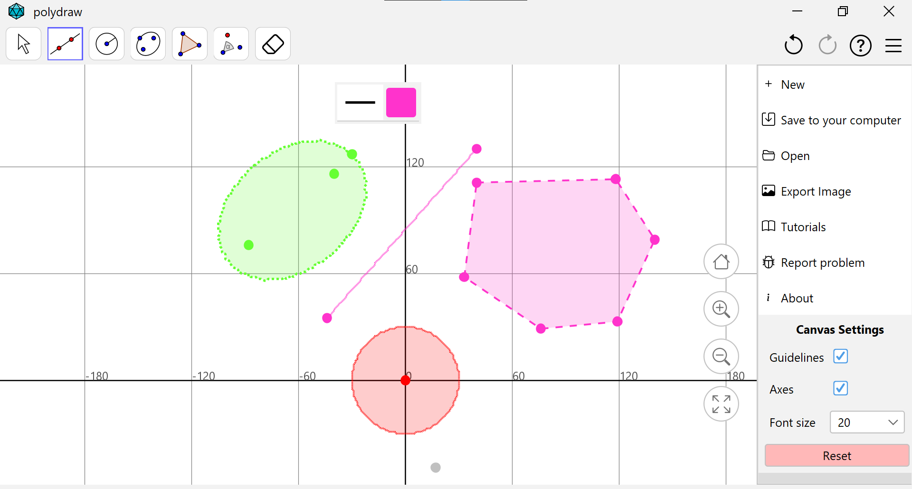
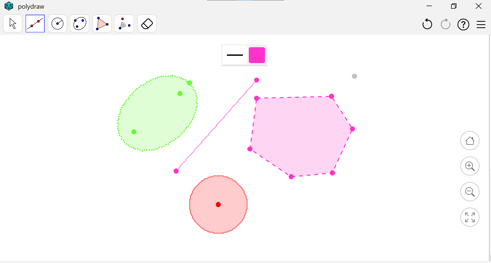
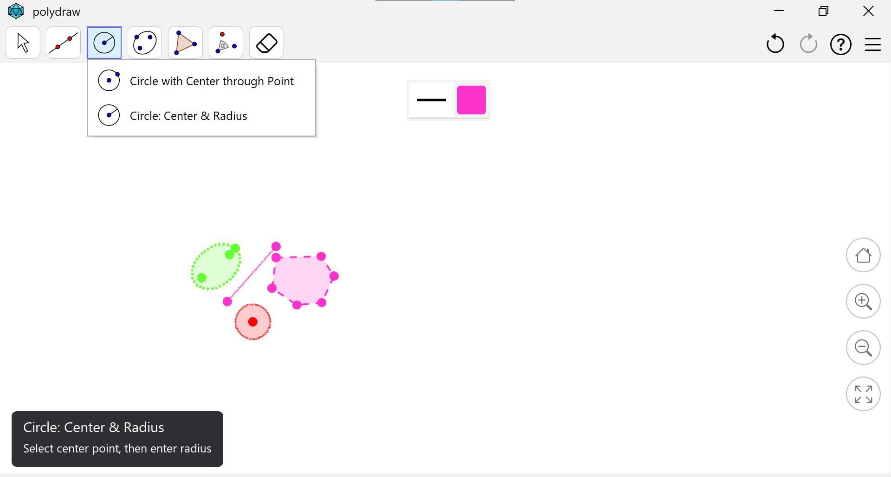
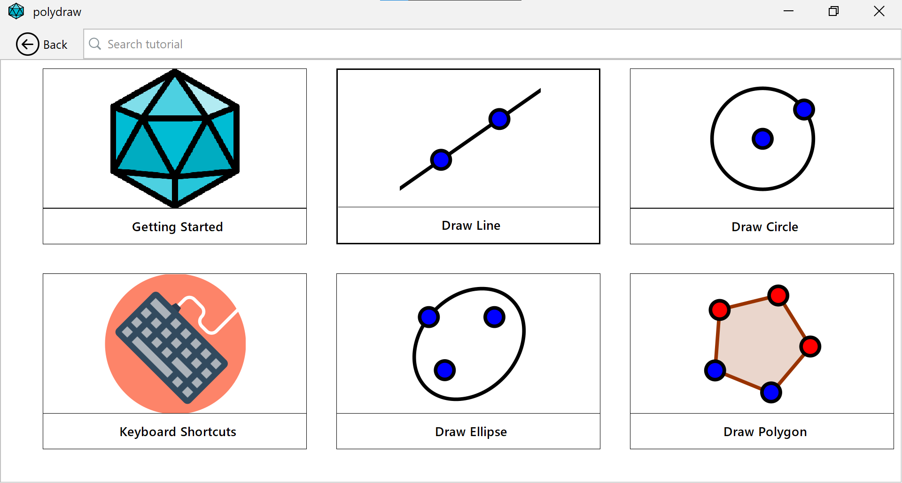
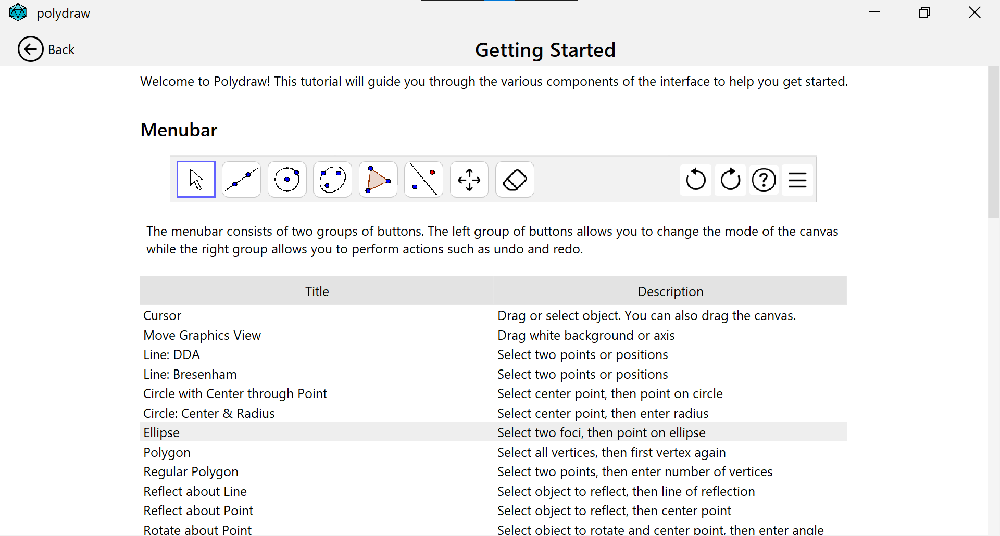

# polydraw 💎

A rasterized shape drawing application, inspired by GeoGebra Classic, developed as part of a UI design assignment. This application allows users to draw various rasterized shapes with a simple and intuitive interface, focusing on user experience and design principles. The project report, which details the design process and key decisions, is available [here](docs/report.pdf).

## Main features

- Scalable coordinate system with drag to move.
- Supports DDA and Bresenham line drawing algorithms.
- Configurable line attributes (type, thickness, color).
- Draw polygons (regular and irregular).
- Configurable polygon attributes (border color, border thickness, fill color).
- Circle drawing using midpoint circle algorithm.
- Animated transformations (translation, rotation, shearing, ...).
- Ellipse drawing using midpoint ellipse algorithm.
- Shape clipping.
- Drag and drop to move shapes.
- Testing with JUnit 4.
- Sidebar with opening and closing animation.
- In-app tutorials with searching functionality.
- Cross-platform GUI.
- Export canvas in PNG and JSON format.
- Keyboard shortcuts.
- Supports undo, redo, and delete operations.

## Screenshots

|                                                                          |                                                                          |
| ------------------------------------------------------------------------ | ------------------------------------------------------------------------ |
|                            |  |
|                           |                    |
|  |                                                                          |

## Documentation

All documentation (installation guide, usage guide, ...) is available in the [`docs`](docs) folder.

## Disclaimer

This project was developed as part of an educational assignment and is not production-ready. Please note that the project is currently incomplete, and no further development is planned.

## Contributors

- [creme332](https://github.com/creme332)
- [Divyeshhhh](https://github.com/Divyeshhhh)
- [Vasheel](https://github.com/Vasheel)
- [Ramoogur](https://github.com/Ramoogur)
- [triya12](https://github.com/triya12)

## References

1. UI and drawing modes graphics were adapted from https://www.geogebra.org/classic.
2. App logo: <a href="https://www.flaticon.com/free-icons/icosahedron" title="icosahedron icons">Icosahedron icon created by Pixel perfect - Flaticon</a>.